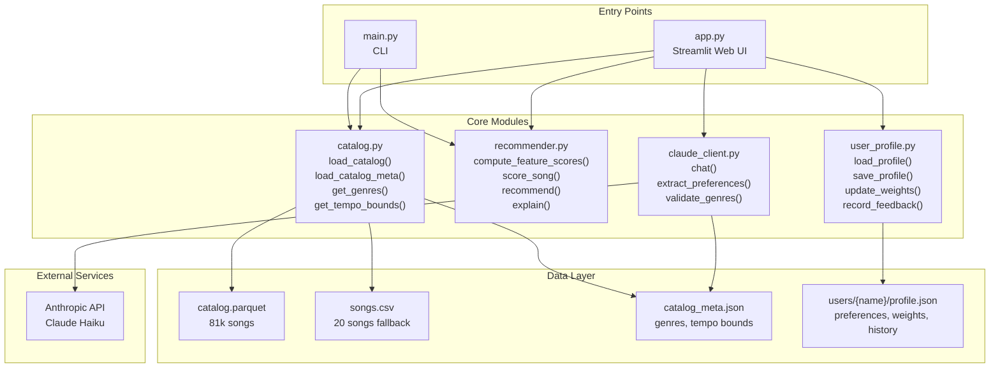
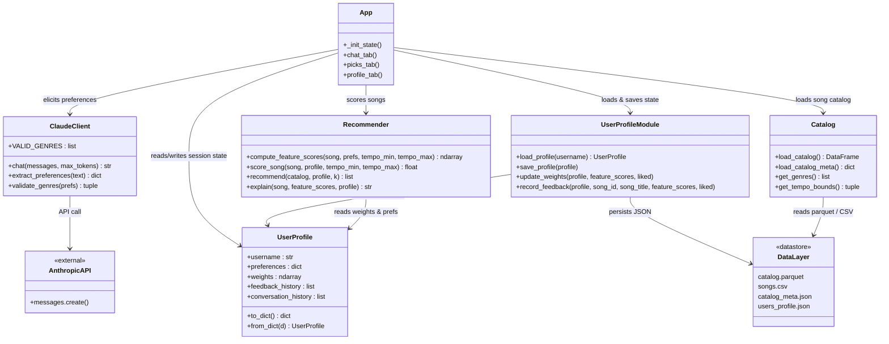
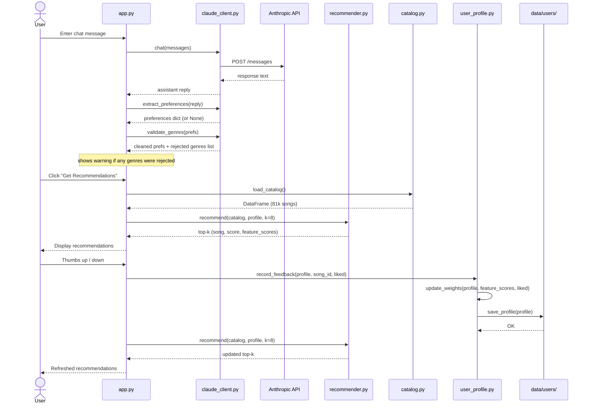
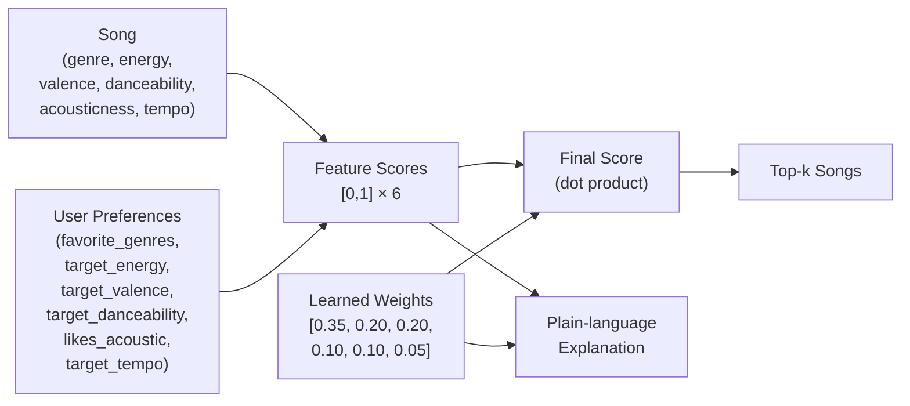
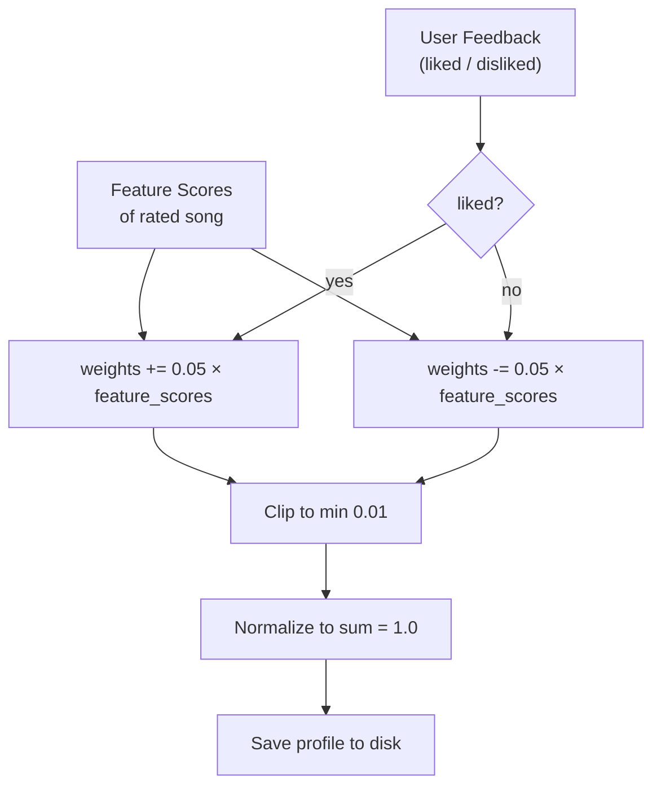

# System Architecture — Applied Music AI

## Component Diagram

---

## Class Diagram

---

## Sequence Diagram — Feedback Loop

---

## Scoring Pipeline

---

## Weight Learning (Online Perceptron)

